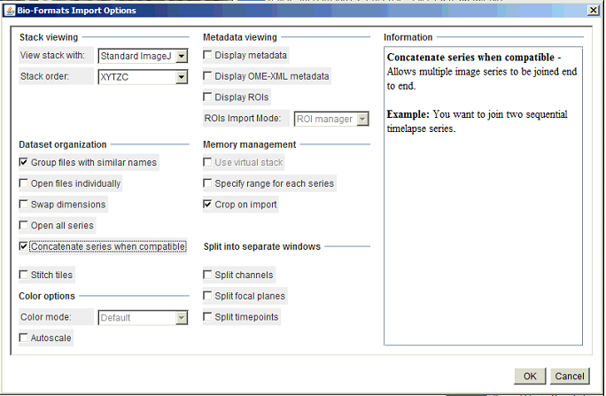

# Cell-attached recording movie generator

Creates side-by-side synchronized imaging and electrophysiology movies

## Author

Ilya Kolb  
Janelia Research Campus  
Howard Hughes Medical Institute  
kolbi@janelia.hhmi.org  

## Dependencies

This code uses functions from the [2P cell-attached pipeline](https://github.com/ilyakolb/2P_cellAttached_pipeline) workflow. 

## Requirements

* Run on APIG computer
* Check directories in `batch_process.py` to confirm they exist

## Installation
1. Download the `cellattached-visualization` directory to your computer

## Usage

1. `conda activate suite2p_backup` (env has pyWavesurfer)
2. `spyder` to run Spyder
3. Open `batch_process.py`
4. Modify `movies_list.xlsx` as needed (see below)
5. Modify `batch_process.py` as needed.
6. Run `batch_process.py`

### movies_list.xlsx

contains list of experiments to be converted to movies. First several columns are imported from `Genie Calcium Imaging` Google Drive spreadsheet. Fill out `start s`, `end s`, `framerate`. The `load` column is evaluated in Python. Set `ignore` column to 1 to ignore the row. Set `movie_dir` to the reg_tif directory (for convenience, not actually used by code). 

### Concatenating TIFFs in time

1. Open first stack
2. Find cell that was patched
3. Draw square, get coordinates for cropping
4. Close
5. Plugins > Bio-Formats > Import
6. Set settings to below:

7. In `movies_list.xlsx` set `crop_top_left`, `square_size`